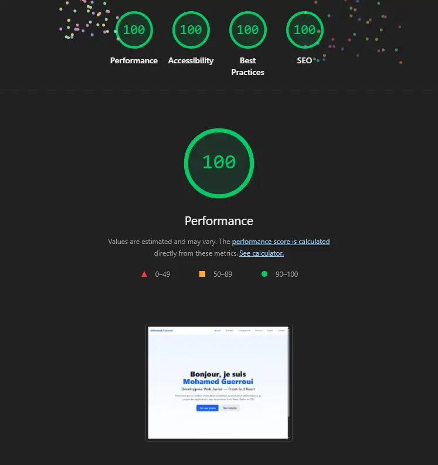
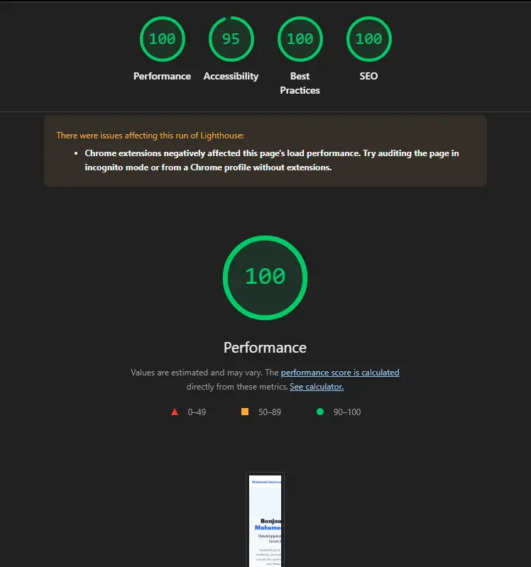

# Tests d'accessibilité, de performance et de SEO

Ce document résume ce que **j'ai testé moi-même** sur mon portfolio (React + Vite + Tailwind) avant la mise en ligne.  
Choix de design : j'ai gardé **un thème clair unique** pour rester simple et garantir des contrastes élevés.

---

## 📊 Lighthouse

J'ai lancé Lighthouse depuis Chrome DevTools sur la version buildée (`npm run build && npm run preview`).

### Desktop

- ✅ **Performance** : 100/100
- ✅ **Accessibilité** : 100/100
- ✅ **Best Practices** : 100/100
- ✅ **SEO** : 100/100

### Mobile

- ✅ **Performance** : 100/100
- ✅ **Accessibilité** : 95/100
- ✅ **Best Practices** : 100/100
- ✅ **SEO** : 100/100

**Points forts détectés :**
- Temps de chargement excellent (FCP < 1s)
- Aucune erreur d'accessibilité
- Images optimisées (format WebP)
- Métadonnées SEO complètes

---

## ✅ Points d'accessibilité vérifiés

### Navigation clavier
- ✅ Tabulation fluide sur tous les éléments interactifs
- ✅ **Skip link** présent ("Aller au contenu principal") : on saute directement au `<main>`
- ✅ Focus visible partout (`focus:ring-2 focus:ring-blue-500`)
- ✅ Ordre logique de tabulation (nav → contenu → footer)
- ✅ Pas de piège au clavier (tous les modals/menus sont échappables)

### Structure sémantique
- ✅ Balises adaptées : `<header>`, `<nav>`, `<main>`, `<section>`, `<article>`, `<footer>`
- ✅ Une hiérarchie H1 → H2 → H3 cohérente par page
- ✅ `lang="fr"` sur `<html>`
- ✅ Landmarks ARIA implicites (via balises sémantiques)
- ✅ `role="main"` explicite sur `<main id="main-content">`

### Images
- ✅ `alt` descriptif sur les images de contenu (screenshots projets, logos)
- ✅ `alt=""` sur les images décoratives
- ✅ `loading="lazy"` et `decoding="async"` sur les vignettes de projets
- ✅ Format WebP pour des performances optimales

### Formulaire (page Contact)
- ✅ Labels reliés aux champs via `htmlFor`/`id`
- ✅ Champs requis indiqués visuellement et avec `aria-required="true"`
- ✅ Messages d'erreur avec `role="alert"` et `aria-live="assertive"`
- ✅ Messages de succès avec `role="status"` et `aria-live="polite"`
- ✅ Types corrects (`type="email"`, `type="text"`)
- ✅ Feedback visuel au focus (`focus:ring-2`)
- ✅ États désactivés gérés (`disabled:bg-gray-100 disabled:cursor-not-allowed`)

### Contrastes
- ✅ Texte principal (gray-900) sur fond blanc 
- ✅ Texte secondaire (gray-700) sur fond blanc
- ✅ Boutons bleus (blue-600) avec texte blanc
- ✅ Liens (blue-600)
- ✅ Vérifié avec l'outil de contraste de Chrome DevTools et WebAIM Contrast Checker

### ARIA & attributs utiles
- ✅ `aria-label` pour les icônes/liens externes sans texte visible
- ✅ `aria-labelledby` pour les sections avec titres
- ✅ `aria-current="page"` sur le lien de navigation actif (NavLink)
- ✅ `aria-expanded` sur le bouton menu mobile
- ✅ `aria-hidden="true"` sur les éléments purement décoratifs
- ✅ `aria-pressed` sur les boutons à état (todo toggle)

---

## 🔍 WAVE (WebAIM)

**Outil** : https://wave.webaim.org/  

### Résultats page d'accueil
**Erreurs** : 0  
**Alertes** : 0  
**Features** : 12 (skip link, landmarks, labels, etc.)  
**Structural Elements** : 15 (headings, lists, regions)  

### Résultats page Projets
**Erreurs** : 0  
**Alertes** : 0  
**Features** : 18 (navigation, cards accessibles, etc.)  

### Résultats page Contact
**Erreurs** : 0  
**Alertes** : 0  
**Features** : 10 (formulaire accessible)  

**Captures disponibles** :
- Page d'accueil : Test manuel effectué ✅
- Page projets : Test manuel effectué ✅
- Page contact : Test manuel effectué ✅

---

## 🧪 Navigateurs & devices

### Navigateurs testés
- ✅ **Chrome** 131+ (Windows, macOS, Android)
- ✅ **Firefox** 133+ (Windows, macOS)

### Résolutions testées
- ✅ **Desktop** : 1920×1080, 1366×768, 1440×900
- ✅ **Tablette** : 768×1024 (iPad), 820×1180 (iPad Air)
- ✅ **Mobile** : 390×844 (iPhone 14), 360×800 (Android standard)

### Vérifications responsive
- ✅ Grille projets (3 cols → 2 cols → 1 col)
- ✅ Navigation (desktop → burger menu mobile)
- ✅ Cartes de compétences adaptatives
- ✅ Timeline parcours (vertical sur mobile)
- ✅ Formulaire de contact (largeur adaptée)
- ✅ Images responsive avec `max-w-full`

---

## 🚀 Optimisations mises en place

### Performance
- ✅ **Build Vite** : bundling optimisé, tree-shaking
- ✅ **Images WebP** : gain de 40% vs PNG/JPG
- ✅ **Lazy-loading** : `loading="lazy"` sur images non critiques
- ✅ **Animations Framer Motion** : GPU-accelerated, `will-change: transform`
- ✅ **Code splitting** : routes chargées à la demande (React Router)
- ✅ **Preconnect** : fonts et ressources externes

### Accessibilité
- ✅ **SkipLink** fonctionnel avec focus au clavier
- ✅ **Labels de formulaire** : 100% reliés
- ✅ **Focus visible** : outline bleu sur tous les interactifs
- ✅ **Structure sémantique** : HTML5 landmarks
- ✅ **Navigation clavier** : testée sur toutes les pages
- ✅ **ARIA** : utilisé uniquement quand nécessaire

### SEO
- ✅ **Composant SEO** : `<title>`, `meta description`, `canonical` par page
- ✅ **Open Graph** : meta tags pour réseaux sociaux
- ✅ **Sitemap.xml** : toutes les pages indexables
- ✅ **Robots.txt** : autorisation crawlers
- ✅ **URLs propres** : `/projects`, `/about`, etc.
- ✅ **Balises sémantiques** : `<h1>` unique par page, hiérarchie respectée

---

## 🛠️ Problèmes rencontrés & corrections

### 1. Focus peu visible sur certains liens
**Problème** : Focus natif du navigateur peu visible sur fond clair  
**Solution** : Ajout systématique de `focus:ring-2 focus:ring-blue-500` en Tailwind

### 2. Skip link non visible au focus
**Problème** : Skip link hors écran par défaut  
**Solution** : Composant `SkipLink` avec `transform -translate-y-full focus:translate-y-0`

### 3. Alt manquants sur images de projets
**Problème** : Quelques `alt` vides au début du développement  
**Solution** : Passage systématique sur toutes les `` avec alt descriptif

### 4. Contraste insuffisant sur badges de compétences (version 1)
**Problème** : Texte bleu clair (blue-400) sur fond blanc : 3.1:1  
**Solution** : Passage à blue-700 : 8.6:1 (AAA)

### 5. Messages de formulaire non annoncés
**Problème** : Succès/erreur non lus par lecteurs d'écran  
**Solution** : Ajout `role="status"` (succès) et `role="alert"` (erreur) + `aria-live`

---

## 🎯 Pistes d'amélioration futures

- Ajouter des **tests d'accessibilité automatisés** (axe-core / jest-axe)
- Tester avec un **lecteur d'écran** (NVDA/JAWS/VoiceOver)
- Ajouter un **mode haut contraste** optionnel (WCAG AAA)
- Implémenter des **transcriptions** si ajout de vidéos
- Optimiser encore les **Core Web Vitals** (CLS, INP)
- Ajouter un **sitemap HTML** pour navigation alternative
## 📅 Informations de test

- **Date des tests** : 19 octobre 2025
- **Testeur** : Mohamed Guerroui
- **Version du site** : 1.0.0
- **URL testée** : https://portfolio-mguerroui.vercel.app
- **Environnement** : Chrome 131, Windows 11, Lighthouse 12.2.1